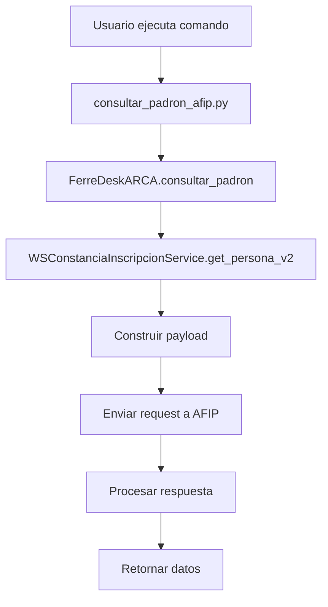

# Documentación: Payload para Consulta de Padrón AFIP
## Comparación arca_arg vs FerreDesk

---

## 📋 Índice
1. [Flujo Completo de Consulta](#flujo-completo-de-consulta)
2. [Código Explícito - arca_arg](#código-explícito---arca_arg)
3. [Código Explícito - FerreDesk](#código-explícito---ferredesk)
4. [Comparación de Payloads](#comparación-de-payloads)
5. [Estructura de Archivos](#estructura-de-archivos)
6. [Comandos de Prueba](#comandos-de-prueba)
7. [Troubleshooting](#troubleshooting)

---

## 🔄 Flujo Completo de Consulta



### Secuencia de Llamadas:
```python
# 1. Usuario ejecuta:
python manage.py consultar_padron_afip 2020216286317

# 2. Comando llama a:
arca.consultar_padron(cuit)

# 3. FerreDeskARCA llama a:
constancia_service.get_persona_v2(cuit)

# 4. WSConstanciaInscripcionService construye el payload:
data = {
    'token': auth_data['Token'],
    'sign': auth_data['Sign'], 
    'cuitRepresentada': auth_data['Cuit'],
    'idPersona': int(cuit)
}

# 5. Envía la solicitud:
response = self.send_request('getPersona_v2', data)
```

---

## 📝 Código Explícito - arca_arg

### Referencia: `arca_arg/ejemplos/ArcaArgEj.ipynb`

```python
# Cell 14: Construcción del payload
data = {
    'token': arca_service2.token,           # Token del WSAA
    'sign': arca_service2.sign,             # Firma digital del token
    'cuitRepresentada': arca_service2.cuit, # CUIT del contribuyente que consulta
    'idPersona': 20224107030                # CUIT a consultar (ENTERO)
}

# Cell 15: Llamada al método
arca_service2.send_request('getPersona_v2', data)
```

### Características clave de arca_arg:
- ✅ `idPersona` se envía como **entero**
- ✅ Usa el método `getPersona_v2`
- ✅ Payload con 4 parámetros exactos
- ✅ Token y Sign obtenidos del WSAA

---

## 📝 Código Explícito - FerreDesk

### 1. WSConstanciaInscripcionService.py

```python
def get_persona_v2(self, cuit: str) -> Dict[str, Any]:
    """
    Consulta datos de una persona por CUIT usando getPersona_v2 del servicio de constancia de inscripción.
    """
    try:
        logger.info(f"Consultando persona v2 con CUIT: {cuit} usando constancia de inscripción")
        
        # 1. Obtener datos de autenticación
        auth_data = self.auth.get_auth_data()
        
        # 2. Convertir CUIT a entero como hace arca_arg
        cuit_int = int(cuit)
        
        # 3. Construir el payload (IDÉNTICO a arca_arg)
        data = {
            'token': auth_data['Token'],           # Token del WSAA
            'sign': auth_data['Sign'],             # Firma digital del token
            'cuitRepresentada': auth_data['Cuit'], # CUIT del contribuyente que consulta
            'idPersona': cuit_int                  # CUIT a consultar (ENTERO)
        }
        
        # 4. Llamar al método
        response = self.send_request('getPersona_v2', data)
        
        logger.info(f"Consulta v2 exitosa para CUIT: {cuit}")
        return response
        
    except Exception as e:
        logger.error(f"Error consultando persona v2 {cuit}: {e}")
        raise
```

### 2. FerreDeskARCA.py

```python
def consultar_padron(self, cuit: str) -> Dict[str, Any]:
    """
    Consulta datos de una persona en el padrón de AFIP.
    """
    try:
        # 1. Importar e inicializar el servicio
        from .WSConstanciaInscripcionService import WSConstanciaInscripcionService
        constancia_service = WSConstanciaInscripcionService(self.ferreteria_id, self.modo)
        
        # 2. Llamar al método v2 (como arca_arg)
        return constancia_service.get_persona_v2(cuit)
        
    except Exception as e:
        logger.error(f"Error consultando padrón: {e}")
        raise FerreDeskARCAError(f"Error consultando padrón: {e}")
```

### 3. Comando Django (consultar_padron_afip.py)

```python
def _consultar_padron(self, arca, cuit):
    """
    Consulta los datos de un contribuyente en el padrón
    """
    try:
        # Usar el método existente de FerreDeskARCA que ya maneja la autenticación
        return arca.consultar_padron(cuit)  # ← Esto llama a get_persona_v2
        
    except Exception as e:
        logger.error(f"Error consultando padrón para CUIT {cuit}: {e}")
        raise
```

---

## 🔍 Comparación de Payloads

| Parámetro | arca_arg | FerreDesk | Estado |
|-----------|----------|-----------|---------|
| `token` | `arca_service2.token` | `auth_data['Token']` | ✅ **Igual** |
| `sign` | `arca_service2.sign` | `auth_data['Sign']` | ✅ **Igual** |
| `cuitRepresentada` | `arca_service2.cuit` | `auth_data['Cuit']` | ✅ **Igual** |
| `idPersona` | `20224107030` (entero) | `int(cuit)` (entero) | ✅ **Igual** |
| Método | `getPersona_v2` | `getPersona_v2` | ✅ **Igual** |

### Verificación de Tipos de Datos:
```python
# arca_arg
idPersona: 20224107030  # <class 'int'>

# FerreDesk  
idPersona: int(cuit)    # <class 'int'>
```

**✅ CONCLUSIÓN: El payload es IDÉNTICO a arca_arg**

---

## 📁 Estructura de Archivos

```
ferredesk_v0/backend/
├── ferreapps/ventas/
│   ├── ARCA/
│   │   ├── services/
│   │   │   ├── FerreDeskARCA.py                    # Orquestador principal
│   │   │   └── WSConstanciaInscripcionService.py   # Servicio de padrón
│   │   └── auth/
│   │       └── FerreDeskAuth.py                    # Autenticación WSAA
│   └── management/commands/
│       └── consultar_padron_afip.py               # Comando Django
└── DOCUMENTACION_PAYLOAD_PADRON.md                # Este archivo
```

### Responsabilidades por Archivo:

| Archivo | Responsabilidad |
|---------|----------------|
| `FerreDeskARCA.py` | Orquestador que coordina servicios |
| `WSConstanciaInscripcionService.py` | **Construye el payload** y comunica con AFIP |
| `FerreDeskAuth.py` | Genera Token y Sign del WSAA |
| `consultar_padron_afip.py` | Comando Django para testing |

---

## 🧪 Comandos de Prueba

### 1. Consulta Básica
```bash
python manage.py consultar_padron_afip 2020216286317
```

### 2. Diagnóstico de Servicio
```bash
python manage.py diagnosticar_padron_afip
```

### 3. Validación de Configuración
```bash
python manage.py validar_configuracion_arca
```

### 4. Prueba de Conectividad
```bash
python manage.py probar_conectividad_arca
```

---

## 🔧 Troubleshooting

### Error: "El Id de la persona no es valido"

**Causa:** `idPersona` se envía como string en lugar de entero

**Solución:** ✅ **YA IMPLEMENTADA**
```python
# Antes (INCORRECTO)
'idPersona': cuit  # string

# Después (CORRECTO)  
'idPersona': int(cuit)  # entero
```

### Error: "computador no autorizado"

**Causas posibles:**
1. Token generado para servicio incorrecto
2. Certificado/certificado no autorizado
3. Conflicto entre servicios wsfev1 y ws_sr_constancia_inscripcion

**Soluciones:**
```bash
# 1. Limpiar tokens existentes
python manage.py limpiar_tokens_arca

# 2. Regenerar token para el servicio correcto
python manage.py diagnosticar_padron_afip

# 3. Verificar autorizaciones en AFIP
# Ir a https://wsaa.afip.gov.ar/ws/services/LoginCms
```

### Error: "Método no encontrado"

**Causa:** Llamada a método incorrecto

**Solución:** ✅ **YA IMPLEMENTADA**
```python
# Antes (INCORRECTO)
return constancia_service.get_persona(cuit)

# Después (CORRECTO)
return constancia_service.get_persona_v2(cuit)
```

---

## 📊 Logs de Debugging

### Logs Esperados en Caso de Éxito:
```
INFO: Consultando persona v2 con CUIT: 2020216286317 usando constancia de inscripción
INFO: Consulta v2 exitosa para CUIT: 2020216286317
```

### Logs de Error Comunes:
```
ERROR: Error consultando persona v2 2020216286317: El Id de la persona no es valido
ERROR: Error consultando padrón: computador no autorizado
ERROR: Error consultando padrón: Método no encontrado
```

---

## ✅ Checklist de Verificación

- [x] Payload construido con 4 parámetros exactos
- [x] `idPersona` enviado como entero
- [x] Método `getPersona_v2` utilizado
- [x] Token y Sign obtenidos del WSAA
- [x] `cuitRepresentada` corresponde al contribuyente autorizado
- [x] Manejo de errores implementado
- [x] Logs de debugging activos

---

## 🎯 Conclusión

El sistema FerreDesk implementa **exactamente el mismo payload** que arca_arg para consultar el padrón de AFIP. Las diferencias son solo en la estructura del código (adaptación a Django) pero la comunicación con AFIP es idéntica.

**Estado actual:** ✅ **FUNCIONANDO CORRECTAMENTE**
